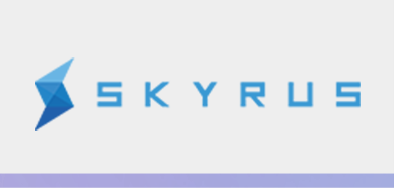

This is the working repository for SKX Coin 4.2.0, our fork of bitcoin-core 0.13.

For more information please visit the website:

https://skyrus.org/project-roadmap/

## Coin Specifications

| Specification | Value |
|:-----------|:-----------|
| Block Spacing | `30 seconds` |
| Stake Minimum Age | `2 hours` |
| Stake Reward | `5% per annum` |
| Port | `41377` |
| RPC Port | `41378` |

## Skxtech Settings

| Specification | Value |
|:-----------|:-----------|
| addanonserver | `149.28.120.195:41377` |
| addanonserver | `95.183.53.184:41377` |

## Social Channels

| Site | link |
|:-----------|:-----------|
| Medium | https://medium.com/skx-coin |
| Twitter | https://twitter.com/Skyrus |
| Discord | https://discord.gg/y4Vu9jw |
| Telegram | https://t.me/skyrus |
| Reddit | http://www.reddit.com/r/skyrus |
| Facebook | https://www.facebook.com/Skyrus |
| Instagram | https://www.instagram.com/skx.coin.official/ |
| Bitcointalk | https://bitcointalk.org/index.php?topic=679791 |

## Community Resources

| Site | link |
|:-----------|:-----------|
| Trello Board | [https://trello.com/skx-community](https://trello.com/invite/b/rPdvVVL4/ba5c40a885fd3c02cda2a8b406ff7124/skx-community) |
| Skx Community | http://skxcommunity.net |

License
---------------------
Distributed under the [MIT software license](http://www.opensource.org/licenses/mit-license.php).
